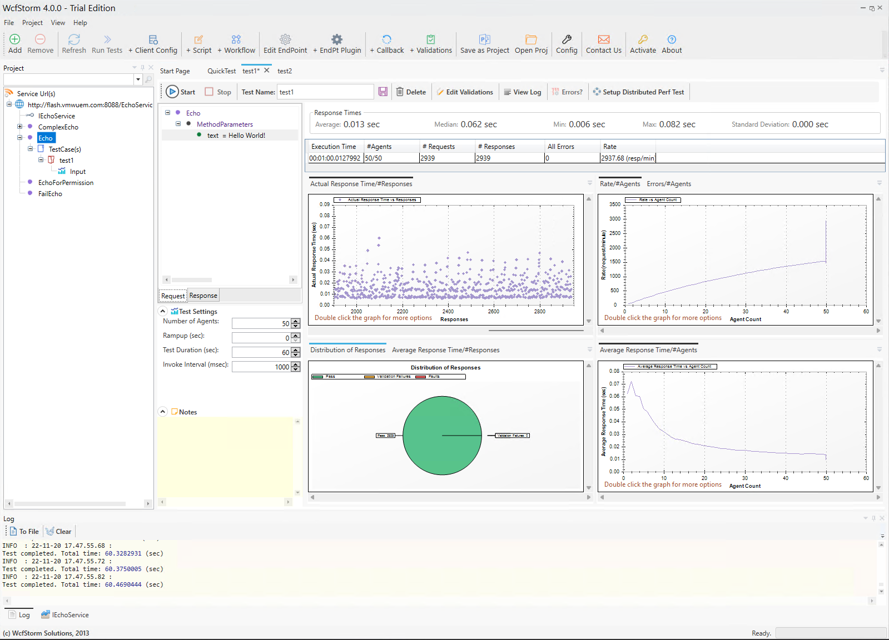

# Core WCF Server and Client

The WCF server uses 

  * BasicHttpBinding
  * WsHttpBinding
  * NetTcpBinding 

and exposes EndPoints for each binding. It uses ASP.NET Core as the host for the services. 
The server also exposes a WSDL endpoint at http://localhost:8088/EchoService. A client can be created using the svcutil tool against the WSDL endpoint. 

```
svcutil.exe http://localhost:8088/EchoService?wsdl
```

The WCF client makes manual calls endpoints with the BasicHttpBinding, WsHttpBinding and NetTcpBindings.
A base address is specified for http which is use as the basis for each of the binding endpoints. 
This base is also used as the URL for WSDL Discovery.  

## echo_server
```
 dotnet run

 docker build . -t tmather99/echo_server
 docker run -p 8088:8088 -p 8443:8443 -p 8090:8090 tmather99/echo_server
```
## echo_client
```
$env:ECHO_SERVER='flash.vmwuem.com'; dotnet run

docker build . -t tmather99/echo_client
docker run -e ECHO_SERVER=flash.vmwuem.com tmather99/echo_client
```

## Load Testing

http://www.wcfstorm.com/wcf/wcfstorm-lite.aspx




## Benchmark

https://github.com/dotnet/BenchmarkDotNet

```
dotnet C:\github\EchoService\Bechmark\bin\Release\net6.0\Bechmark.dll -f *CallBasicHttpBinding*
dotnet C:\github\EchoService\Bechmark\bin\Release\net6.0\Bechmark.dll -f *CallWsHttpBinding*
dotnet C:\github\EchoService\Bechmark\bin\Release\net6.0\Bechmark.dll -f *CallNetTcpBinding*
```

```
|               Method |     Mean |     Error |   StdDev |   Median  |    Gen0 | Allocated |
|--------------------- |---------:|----------:|----------:|---------:|--------:|----------:|
| CallBasicHttpBinding | 6.163 ms | 0.3810 ms | 1.062 ms  | 5.708 ms | 23.4375 |  93.46 KB |
| CallWsHttpBinding    | 5.978 ms | 0.2252 ms | 0.6639 ms |          | 23.4375 |  96.61 KB |
| CallNetTcpBinding    | 7.510 ms | 0.3220 ms | 0.9443 ms | 31.2500  | 15.6250 | 234.18 KB |
```


```
|            Method.   |     Mean |    Error  |   StdDev  |    Gen0 |    Gen1 | Allocated |
|--------------------- |---------:|----------:|----------:|--------:|--------:|----------:|
| CallBasicHttpBinding | 7.647 ms | 0.1367 ms | 0.1212 ms | 15.6250 |         |  93.54 KB |
| CallWsHttpBinding    | 7.588 ms | 0.1161 ms | 0.1086 ms | 15.6250 |         |  96.67 KB |
| CallNetTcpBinding    | 12.05 ms | 0.178 ms  | 0.167 ms  | 31.2500 | 15.6250 |  233.9 KB |
```


